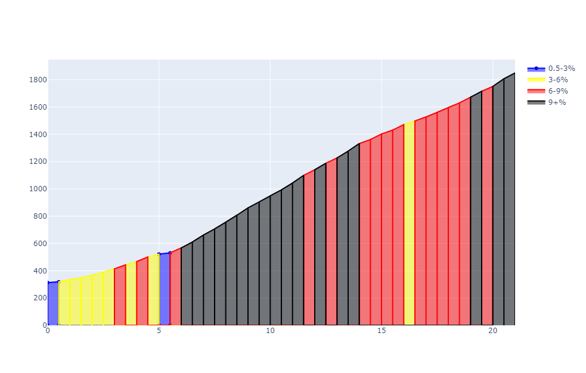

# Elevation Grade Graph

Create a coloured graph of the grade of segments of a GPX track for cycling.

I've always liked the coloured elevation graphs that they use in cycling grand tours (like the Tour de France) to show how hard different parts of a climb are.

I couldn't find an easy way to generate these, so I created this program.

Live demo available at: <https://elevation-graph.techdomi.com/>

## Installation

1. Install python 3.x
2. Clone the repository
3. `pip install -r requirements.txt`

## Command-line usage

The format for using the command-line interface is:

`python3 elevation.py <file.gpx> <km-increment>`

where:

- `<file.gpx>` - the gpx file (with elevation) you want to be graphed
- `<km-increment>` - the length in km for each bar of elevation

The program will open your browser to display the graph. You may need to refresh the browser for it to work for some reason.

## Web interface usage

You can also use this program via a web interface:

`flask run`

You should then be able to go to `http://127.0.0.1:5000/` to see a page where you can upload the gpx file and set the km increments, as above.
